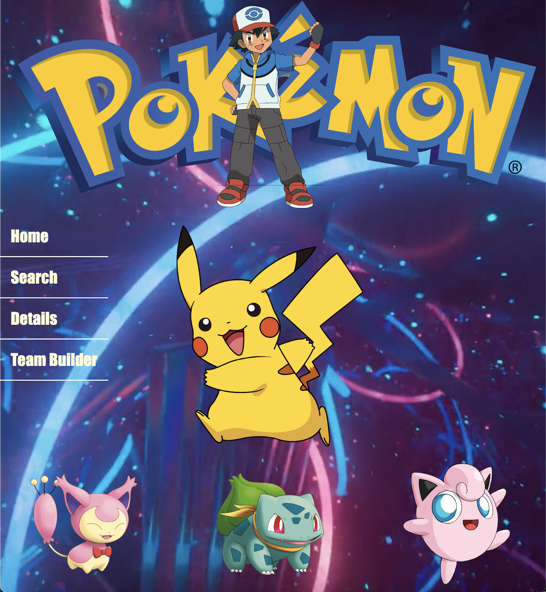
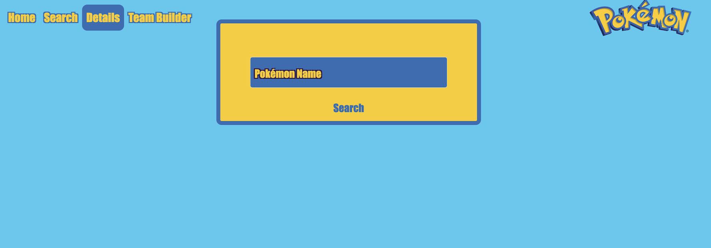
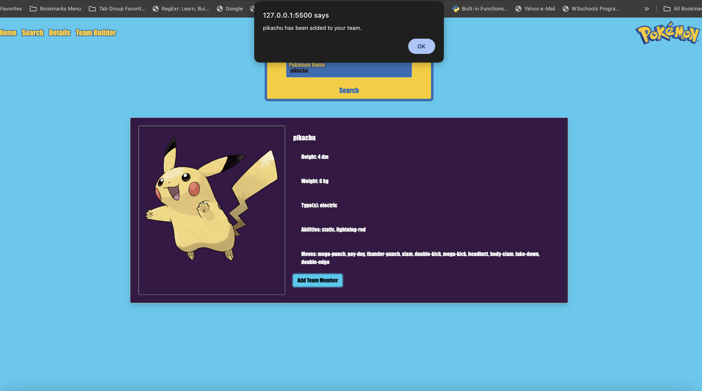
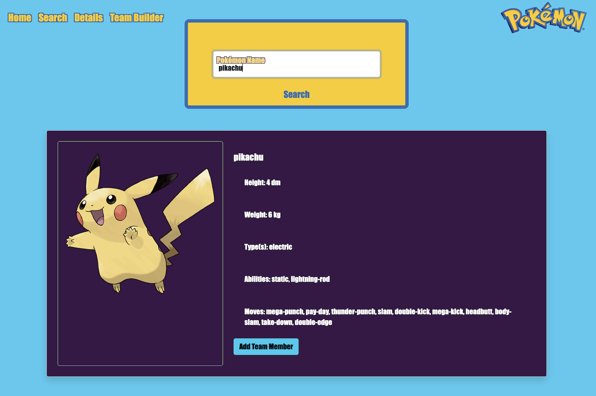
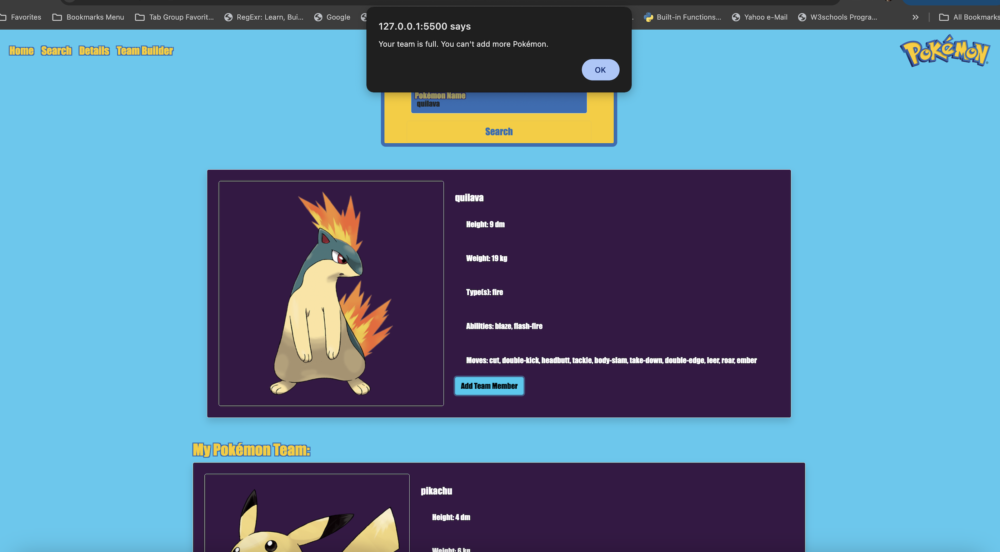
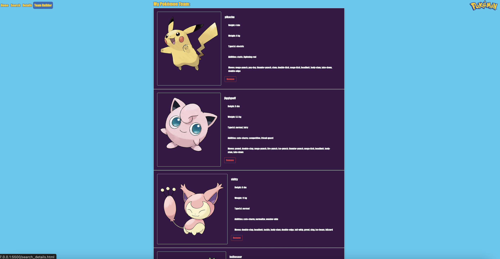
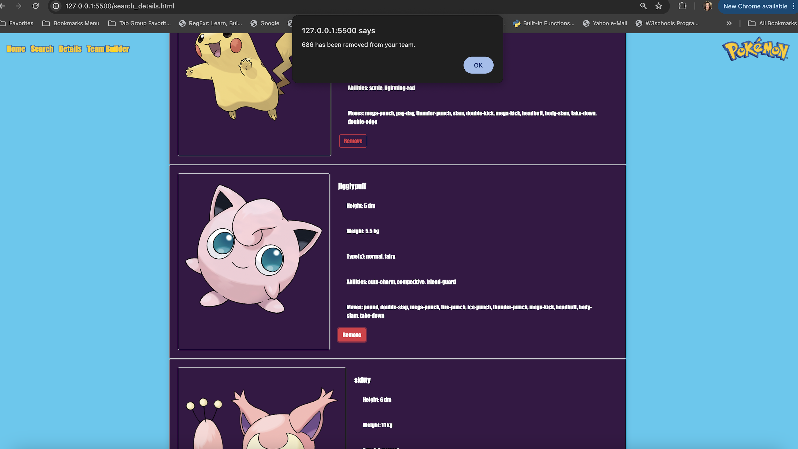

# PokeAPI Integration Project

Welcome to our PokeAPI Integration Project, built & designed by Karen Campos & Kayla Ard! This web application provides users with an immersive experience into the world of Pokémon. Leveraging HTML, Bootstrap, CSS, and JavaScript, the application offers dynamic and interactive features for exploring Pokémon data and information.

## Features

### Homepage
- A visually appealing landing page designed with HTML, Bootstrap components and custom CSS styles.
- Responsive design principles ensure compatibility across various devices and screen sizes.
- Features a landing page with a video background and navigation links to various sections of the application. Users can navigate to the Search page, Details page, or Team Builder page.

### Pokémon Search Page
- Users can enter a Pokémon's name or ID to retrieve relevant information.
- JavaScript functions fetch data from the PokeAPI and dynamically update the webpage content based on user input.

### Pokémon Details Page
- Displays comprehensive information about a specific Pokémon, including abilities, types, stats, and images.
- Bootstrap cards and forms used to present Pokémon details.
- Enhanced CSS styling for better presentation and readability.

### Pokémon Team Builder
- Allows users to assemble and customize their Pokémon teams of 4.
- Implements interactive forms for adding and removing Pokémon from the team.

### Pokémon Search, Details, and Team Builder User Instructions 

1. **Search for a Pokémon:**
   - Enter a Pokémon's name or ID in the search input field.
   - Click the **Search** button to retrieve and display the Pokémon's details.
   - The details include the Pokémon's image, height, weight, types, abilities, and moves.

2. **Add to Team:**
   - Click the **Add Team Member** button to add the displayed Pokémon to your team.

3. **View Team:**
  - The team display section shows the Pokémon currently in the user's team.
  - Each team member is displayed with their details and an option to remove them from the team.

4. **Remove from Team:**
  - Click the **Remove** button to remove a Pokémon from your team.

## Technologies Used
- **HTML**
- **CSS**
- **Bootstrap**
- **JavaScript**
- **PokeAPI**: [https://pokeapi.co/](https://pokeapi.co/)

## **Screenshots of the website are below**

